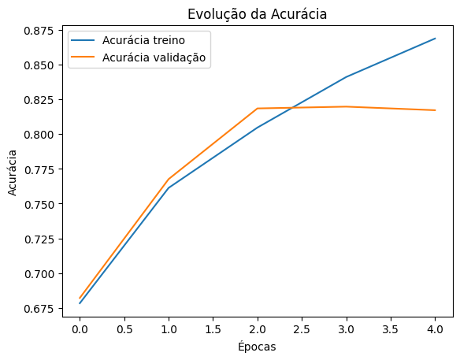

# Classificador de Imagens - Gatos vs Cachorros (CNN com TensorFlow)

Este projeto implementa uma Rede Neural Convolucional (CNN) para classificar imagens de gatos e cachorros, utilizando o dataset `microsoft/cats_vs_dogs`, disponibilizado pela Hugging Face.

---

##  Tecnologias Utilizadas

- Python 3.11
- TensorFlow / Keras
- Hugging Face Datasets
- Matplotlib

---

## Etapas do Projeto

### 1. Carregamento do Dataset
Utilizamos o dataset `microsoft/cats_vs_dogs` diretamente da Hugging Face, com rótulos binários (`0 = gato`, `1 = cachorro`).

### 2. Pré-processamento
- Conversão das imagens para RGB
- Redimensionamento para `128x128`
- Normalização dos valores dos pixels para o intervalo `[0, 1]`

### 3. Divisão do Dataset
- 80% para treino
- 10% para validação
- 10% para teste

### 4. Modelo CNN
Estrutura utilizada:
- `Conv2D → MaxPooling`
- `Conv2D → MaxPooling`
- `Conv2D → MaxPooling`
- `Flatten → Dense → Dropout → Dense`

### 5. Treinamento
Treinamento realizado por 5 épocas com resultados progressivos de acurácia.

---

## Resultados

- **Acurácia no conjunto de teste:** 83,26%
- **Perda (loss) no teste:** 0.3893

> O modelo apresentou um bom desempenho com generalização consistente.

---

##  Como Rodar Localmente

1. Clone o repositório:
git clone https://github.com/MatheusPrause/deep-learning-cats-vs-dogs.git
cd deep-learning-cats-vs-dogs

2. Crie e ative um ambiente virtual:
python -m venv venv
venv\Scripts\activate  # Windows

3. Instale as dependências:
bash
Copiar
Editar
pip install -r requirements.txt

4. Execute o notebook:
bash
Copiar
Editar
jupyter notebook

Arquivos
deep_learning_cats_vs_dogs.ipynb: notebook principal
modelo_gatos_cachorros.h5: modelo treinado salvo
output.png: gráfico da evolução da acurácia
README.md: este arquivo

## Autor
 ### Desenvolvido por **Matheus Maximowitz Prause** como parte de um projeto de estudo em Deep Learning e Visão Computacional.